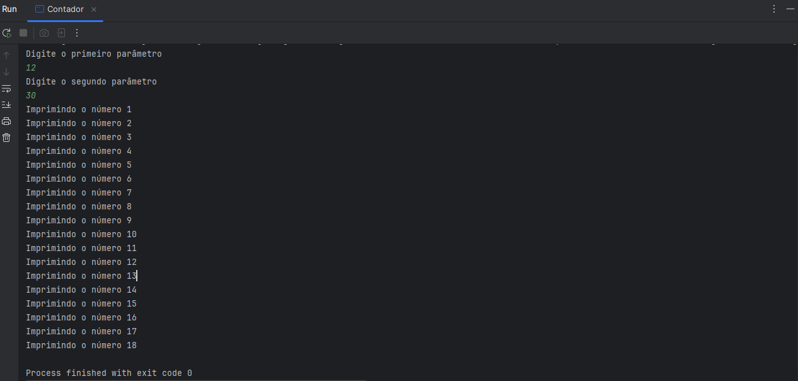

# Desafio Controle de Fluxo

Este projeto foi desenvolvido como parte do curso Trilha Java Básico da DIO. O objetivo do desafio é criar um sistema de controle de fluxo que receba dois números inteiros via terminal e realize a contagem incrementada entre eles, com validação de parâmetros.

## Funcionalidades

- Recebe dois números inteiros via terminal.
- Valida se o segundo número é maior que o primeiro.
- Imprime a contagem dos números entre o primeiro e o segundo parâmetro.
- Lança exceção customizada (`ParametrosInvalidosException`) quando o segundo parâmetro é menor que o primeiro.

## Tecnologias Utilizadas

- Java 17
- IntelliJ IDEA
- Controle de versão com Git

## Exemplo de Uso

### Teste 1: Parâmetro inválido

**Entrada**:
- Primeiro número: `30`
- Segundo número: `18`

**Saída**:
```bash
O segundo parâmetro deve ser maior que o primeiro
```

**Evidência**:


---

### Teste 2: Contagem de números válidos

**Entrada**:
- Primeiro número: `12`
- Segundo número: `30`

**Saída**:
```bash
Imprimindo o número 1
Imprimindo o número 2
...
Imprimindo o número 18
```

**Evidência**:


## Links Importantes

- [Link do Desafio](https://github.com/digitalinnovationone/trilha-java-basico/tree/main/desafios/controle-fluxo)


## Contato

Estou sempre aberto a colaborações e discussões sobre qualidade de software! Vamos nos conectar!

[](https://www.linkedin.com/in/nilsondasilvabrites/)
[](https://github.com/nilrd)
[](https://wa.me/5511940825120)
[](mailto:nilson.brites@gmail.com)
